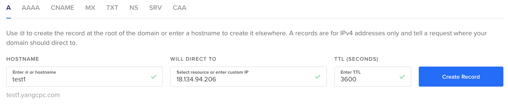

# SSE Deployment

SSE service could be deployed by both docker-compose and MiCADO.

## Deployment SSE service with docker-compose
It is possible to deploy all the SSE components on a single host using docker-compose. The following part describes how to do that.
### 0. Preliminaries
#### 0.1 Create an instance from either AWS or Azure 
For instance, you could select *Instance Image* & *Instance Type* as "Ubuntu Server 20.04 LTS" and "t2.micro" on AWS respectively.
#### 0.2 docker installation
SSH to the instance that you created in #0.1 and execute the following commands to install docker.

    1. sudo apt-get update    
    2. sudo apt install apt-transport-https ca-certificates curl gnupg-agent software-properties-common
    3. curl -fsSL https://download.docker.com/linux/ubuntu/gpg | sudo apt-key add -
    4. sudo add-apt-repository "deb [arch=amd64] https://download.docker.com/linux/ubuntu $(lsb_release -cs) stable"
    5. sudo apt update
    6. sudo apt install docker-ce docker-ce-cli containerd.io
    7. sudo systemctl status docker
#### 0.3 docker-compose installation
SSH to the instance that you created in #0.1 and execute the following commands to install docker-compose.

Install the old version of docker-compose:

    1. sudo curl -L "https://github.com/docker/compose/releases/download/1.29.2/docker-compose-$(uname -s)-$(uname -m)" -o /usr/local/bin/docker-compose
    2. sudo chmod +x /usr/local/bin/docker-compose
    3. docker-compose --version

Install the up-to-date version of docker compose:

    1. mkdir -p ~/.docker/cli-plugins/
    2. curl -SL https://github.com/docker/compose/releases/download/v2.3.3/docker-compose-linux-x86_64 -o ~/.docker/cli-plugins/docker-compose
    3. chmod +x ~/.docker/cli-plugins/docker-compose
    4. sudo chown $USER /var/run/docker.sock
    5. docker compose version

Note that you could install any docker-compose version. The following part of this chapter uses the old docker-compose version. If you install the up-to-date version, few following commands may slightly different, such as `docker compose up -d` instead of `docker-compose up -d`.  
#### 0.4 DNS (Optional)
If you would like to deploy a TLS layer in SSE service, you must set up DNS. 

For instance, you will achieve a public ip address (i.e. 18.134.94.206) once you finish #0.1.  

Then, go to [digitalocean](https://cloud.digitalocean.com/networking/domains) and bind your domain name with the public ip address.

### 1.  Get the docker-compose definition from the repository
    git clone https://gitlab.com/asclepios-project/sse-deployment

 Two docker-compose files could be achieved, namely "docker-compose-without-tls.yml" and "docker-compose-tls.yml".   

 The "docker-compose-without-tls.yml" file involves the definitions of the SSE server, SSE TA, SSE client, MinIO Server, and TEEP deployer server. While, the "docker-compose-tls.yml" file involves the definitions of the SSE server, SSE TA, SSE client, certbot, ta-proxy (Nginx), MinIO Server, and TEEP deployer server. If you do not need to use SGX for SSE TA, and/or use MinIO Server, you can customize the docker-compose file by removing teep-server and/or minio definitions.    

 The main difference between these two files is that "docker-compose-tls.yml" adds a TLS layer in order to increase security level on SSE TA.
   
### 2. Configure the environmental variables
    cd sse-deployment

 If using SGX at SSE TA:

    cp template_sgx.env .env 
 If not using SGX at SSE TA:

    cp template_nonsgx.env .env

 Edit the .env file to modify the configurations and more details could be found in [SSE_deployment_manual](https://gitlab.com/asclepios-project/ssemanual/-/blob/develop/SSE_deployment_manual.pdf).

#### 2.1 For speed up the environmental variables configuration, you can do the following.

##### 2.1.1 If you don't want to create a TLS layer for SSE service, then do the following steps.

    nano example-without-tls.env
   Then, change the following variables to your own environmental variables.

    TA_ALLOWED_HOSTS="YOUR_INSTANCE_PUBLIC_IP_ADDRESS ta"
    SSE_SERVER_ALLOWED_HOSTS="YOUR_INSTANCE_PUBLIC_IP_ADDRESS sse"
    MINIO_URL=YOUR_INSTANCE_PUBLIC_IP_ADDRESS:9000
    SSE_CLIENT_ALLOWED_HOSTS="YOUR_INSTANCE_PUBLIC_IP_ADDRESS client"
    SSE_CLIENT_TA_URL=http://YOUR_INSTANCE_PUBLIC_IP_ADDRESS:8000
    SSE_CLIENT_SSE_URL=http://YOUR_INSTANCE_PUBLIC_IP_ADDRESS:8080
    SSE_CLIENT_CP_ABE_URL=http://YOUR_INSTANCE_PUBLIC_IP_ADDRESS:8084

   Once it's finished, execute the following command.

    mv example-without-tls.env .env

##### 2.1.2 If you want to create a TLS layer for SSE servic, do the following steps.

    nano example-with-tls.env
   Then, change the following variables to your own environmental variables.
    
    TA_ALLOWED_HOSTS="YOUR_DOMAIN_NAME ta"
    SSE_SERVER_ALLOWED_HOSTS="YOUR_INSTANCE_PUBLIC_IP_ADDRESS sse"
    SSE_SERVER_TA_SERVER=https://YOUR_DOMAIN_NAME:443
    MINIO_URL=YOUR_INSTANCE_PUBLIC_IP_ADDRESS:9000
    SSE_CLIENT_ALLOWED_HOSTS="YOUR_INSTANCE_PUBLIC_IP_ADDRESS client"
    SSE_CLIENT_TA_URL=https://YOUR_DOMAIN_NAME:443
    SSE_CLIENT_SSE_URL=http://YOUR_INSTANCE_PUBLIC_IP_ADDRESS:8080
    SSE_CLIENT_CP_ABE_URL=http://YOUR_INSTANCE_PUBLIC_IP_ADDRESS:8084

  Once it's finished, execute the following command.

    mv example-with-tls.env .env

### 3. Build the docker images
    sudo docker-compose build

 **If you just would like to deploy the SSE service, you can skip this part -"Build the docker images".** 

 The following part will describe how to run SSE service with "docker-compose-without-tls.yml" (#4.1) and "docker-compose-tls.yml" (#4.2) separately.

### 4.1 Run SSE service with docker-compose-without-tls.yml
   Rename "docker-compose-without-tls.yml" to "docker-compose.yml"

    mv docker-compose-without-tls.yml docker-compose.yml
   
   Then, start the SSE service.

    docker-compose up

### 4.2 Run SSE service with docker-compose-tls.yml
#### 4.2.1 Update the certbot entry in ‘docker-compose-tls.yml’ with email and domain
 First, edit ‘docker-compose-tls.yml’ with your favourite editor
    
    nano docker-compose-tls.yml 

 Scroll down to certbot and modify the --email and -d parameters. Save the file. 

    --email YOUR_EMAIL_ADDRESS
    -d YOUR_DOMAIN_NAME

 Rename ‘docker-compose-tls.yml’ to ‘docker-compose.yml’

    mv docker-compose-tls.yml docker-compose.yml

#### 4.2.2 Update the 'nginx.http' file with the domain name 
    nano nginx.http 
    server_name YOUR_DOMAIN_NAME

 Rename ‘nginx.http’ to ‘nginx.conf’

    mv nginx.http nginx.conf

#### 4.2.3 Run the SSE service
    sudo docker-compose up -d

#### 4.2.4 Update the ‘nginx.https’ file with the domain name 
    nano nginx.https

    server_name YOUR_DOMAIN_NAME
    /etc/letsencrypt/live/YOUR_DOMAIN_NAME/fullchain.pem; 
    /etc/letsencrypt/live/YOUR_DOMAIN_NAME/privkey.pem;

 Rename ‘nginx.conf’ to ‘nginx.http’

    mv nginx.conf nginx.http

 Rename ‘nginx.https’ to ‘nginx.conf’

    mv nginx.https nginx.conf

#### 4.2.5 Restart the Nginx service
    docker-compose restart ta-proxy

**P.S.** If you deploy all the SSE components on a single host, you will need to change SSE client port number (in docker-compose-tls.yml) from (-80:80) to (-81:80) in order to avoid port conflicts with ta-proxy container.

## Deployment SSE service using MiCADO
### 0. Preliminaries
#### 0.1 MiCADO installation
 The details of MiCADO installation can be found in [MiCADO installation ](https://micado-scale.readthedocs.io/en/develop/deployment.html) , but two steps below need to be updated during the installation.
 
 **i. Download the ansible playbook from the develop branch**
 
    git clone https://github.com/micado-scale/ansible-micado
    cd ansible-micado
    git checkout develop

 **ii. ‘cert-manager.yaml’ and ‘traefik-rbac.yaml’ need to be installed on the MiCADO master before the deployment.**

 (1) SSH to MiCADO master node.

 (2) Cope ‘cert-manager.yaml’ and ‘traefik-rbac.yaml’ files to any directory in MiCADO master node.

 (3) Run the commands below.

    sudo kubectl apply -f cert-manager.yaml
    sudo kubectl apply -f traefik-rbac.yaml

### 1. Deployment using MiCADO
 Four ADT templates (below) could be found in [sse-deployment](https://gitlab.com/asclepios-project/sse-deployment). 

    Template_SSE_without_TLS_AWS.yaml
    Template_SSE_without_TLS_Azure.yaml
    Template_SSE_with_TLS_AWS.yaml
    Template_SSE_with_TLS_Azure.yaml

 The next step is to configure the ADT file and then run the command on Ansible Remote machine to deploy the SSE service (Some tutorials of how to deploy applications on MiCADO could be find in [Tutorials](https://micado-scale.readthedocs.io/en/latest/tutorials.html)).
 
 For further details, you can also read about the SSE service deployment in [SSE_deployment_manual](https://gitlab.com/asclepios-project/ssemanual/-/blob/develop/SSE_deployment_manual.pdf).

 **P.S.** The SSE ADT examples and SSE service test reports could be found in the "ADT examples" folder of [sse-deployment](https://gitlab.com/asclepios-project/sse-deployment).

