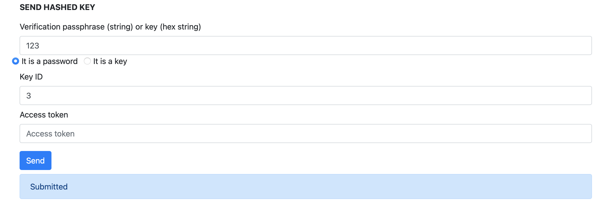
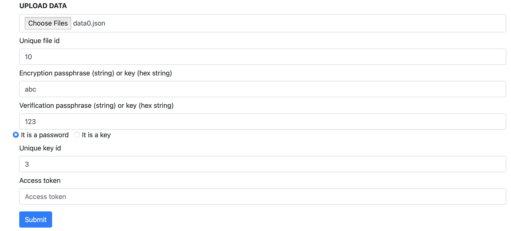
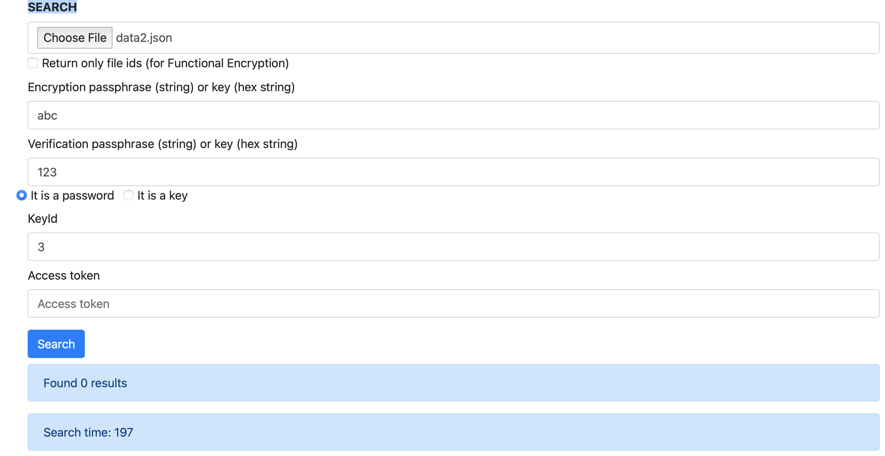
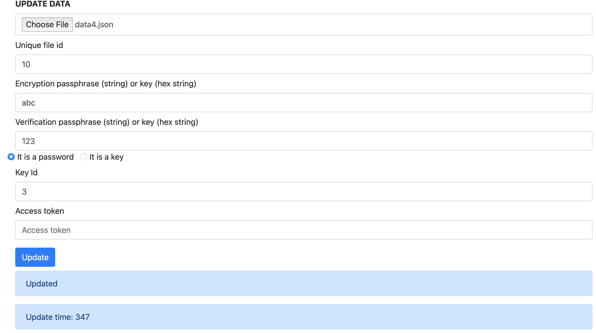
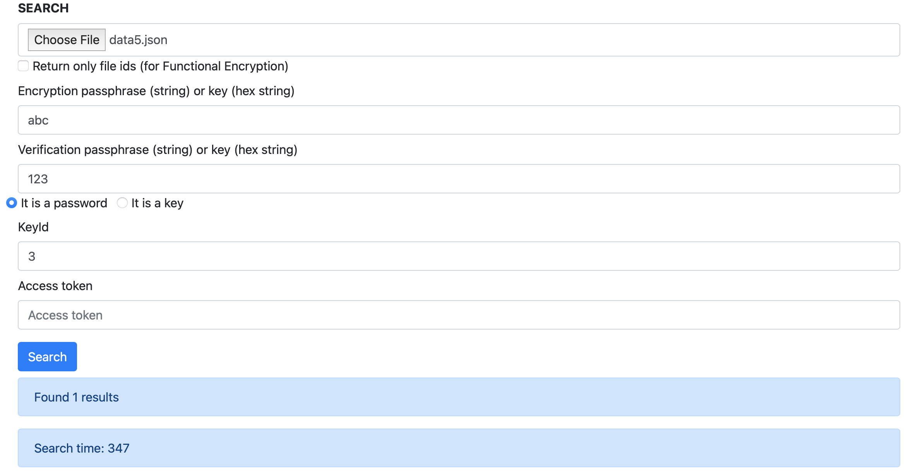
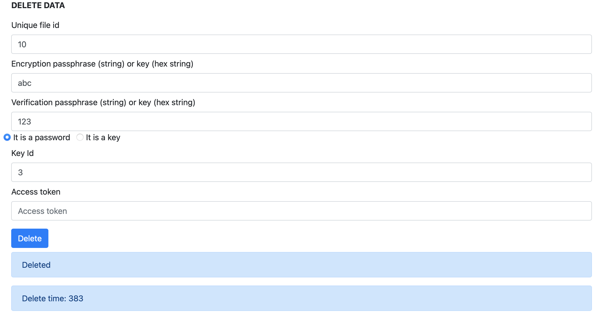
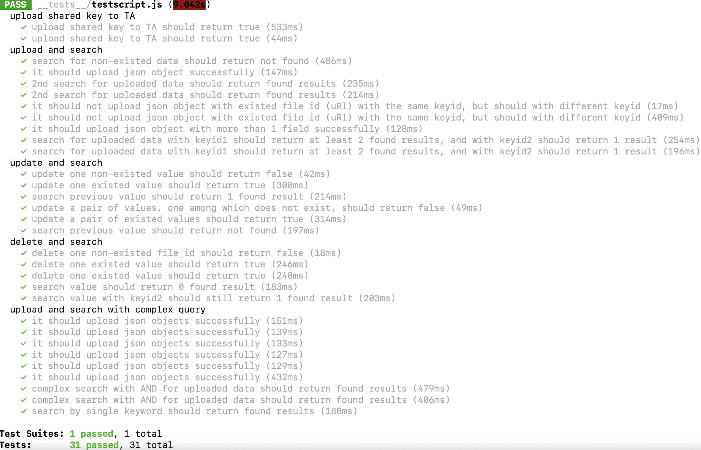

# SSE Testing
After deploying the SSE service, it's time to test SSE service. 

There are two ways to test it. One is manual testing and another one is automatic testing.

## Manual testing
Open the browser and type the **SSE_Client_IP_Address:Port number**, you will reach a website called "Medical Health Record". Some figures below show the different functions in SSE service.

### Function 1: SEND HASHED KEY

According to the figure, the shared key has been uploaded to the database.

### Function 2: UPLOAD DATA

According to the figure above, *data0.json*(
      ``` 
      {
        "name": "white",
        "age": 50
      }
      ```
) has been submitted to the database. The details of how to write a proper json file could be reached in [SSE_API_specification.pdf](https://gitlab.com/asclepios-project/ssemanual/-/blob/master/SSE_API_specification.pdf).

### Function 3: SEARCH

According to the figure above, *data2.json*(
      ``` 
      {
        "keyword": "age|20"
      }
      ```
) has been submitted to the database and no file (containing age=20) could be returned from the database.

### Function 4: UPDATE DATA

According to the figure above, *data4.json*(
      ``` 
      {
        "name": ["white","Peter"]
      }
      ```
) has been submitted to the database and the name in *data0.json* has been changed from "white" to "Peter".

### Repeat SEARCH again

According to the figure above, *data5.json*(
      ``` 
      {
        "keyword": "name|Peter"
      }
      ```
) has been submitted to the database and one result could be returned from the database. (P.S. By Function 4, the database should contain one result.)

### Function 5: DELETE DATA

According to the figure above, the file (file id = 10) has been deleted from the database.

## Automatic testing
Jest is applied to test SSE service automatically. The details could be found in [SSE_verification](https://gitlab.com/asclepios-project/ssemanual/-/blob/master/SSE_verification.pdf). 

Besides, the figure below shows an example of the Jest result.
